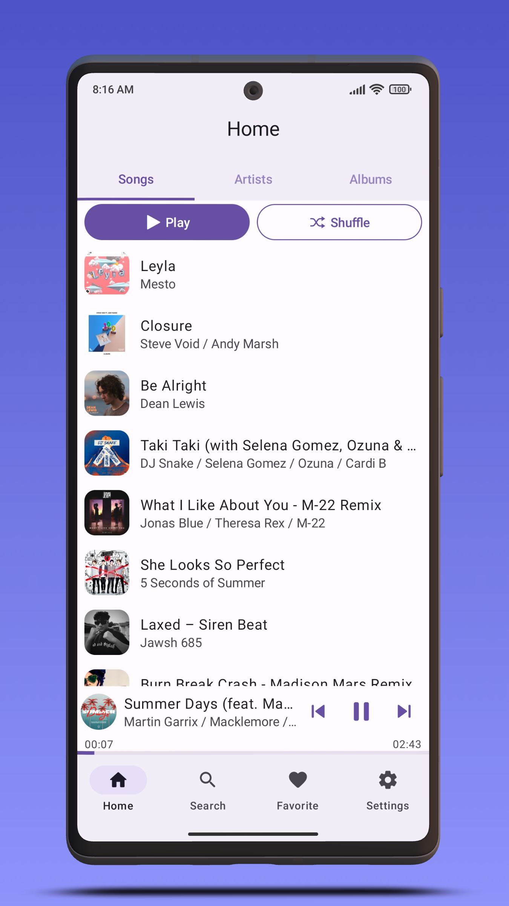
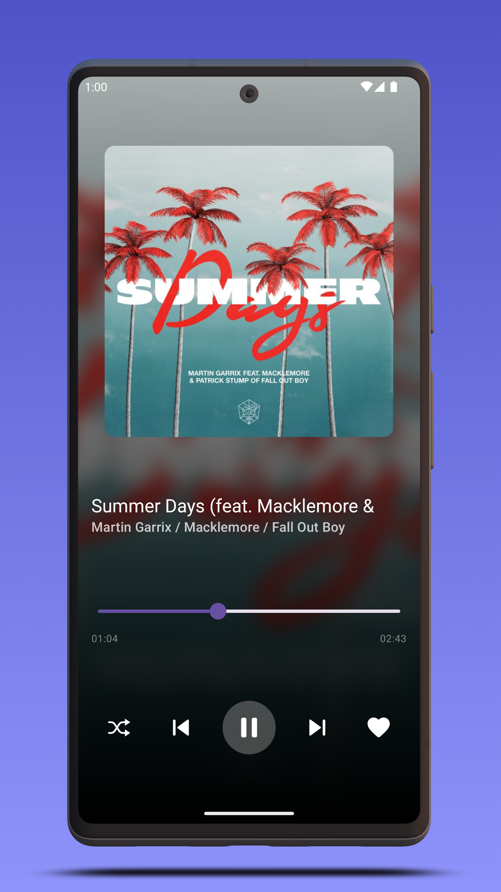
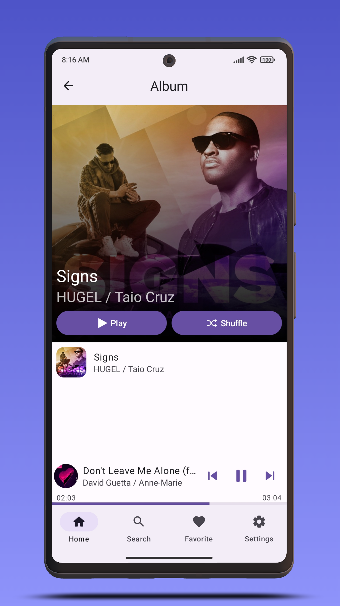
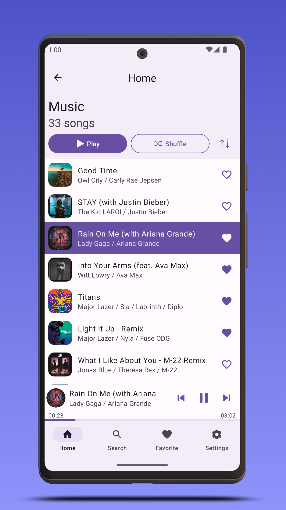
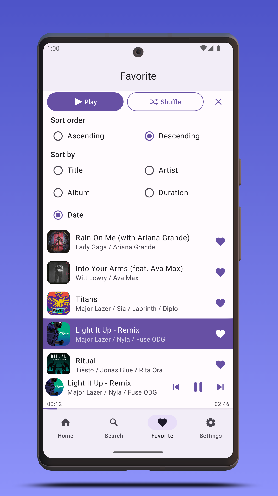
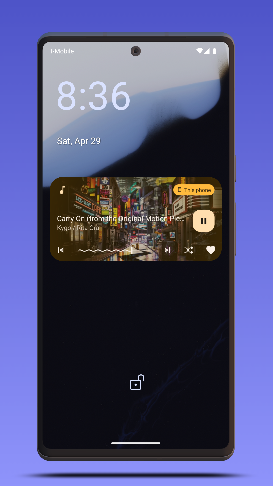

# Musicmax

Musicmax is a Music Player application for Android built with Jetpack Compose and Jetpack Media 3.

<a href='https://play.google.com/store/apps/details?id=com.maximillianleonov.musicmax&pcampaignid=pcampaignidMKT-Other-global-all-co-prtnr-py-PartBadge-Mar2515-1'></a>

or get the apk from the [Releases section](https://github.com/MaximillianLeonov/Musicmax/releases/latest).

# Preview




# Development Environment

**Musicmax** uses the Gradle build system and can be imported directly into the latest stable
version of Android Studio (available [here](https://developer.android.com/studio)). The `debug`
build can be built and run using the default configuration.

# Build

The app contains the usual `debug` and `release` build variants.

In addition, the `benchmark` variant of `app` is used to test startup performance and generate a
baseline profile (see below for more information).

For normal development use the `debug` variant. For UI performance testing use the `release`
variant.

# Architecture

The **Musicmax** app follows the
[official architecture guidance](https://developer.android.com/topic/architecture).


# Modularization

The **Musicmax** app has been fully modularized.

# UI

The app was designed using [Material 3 guidelines](https://m3.material.io/).

The Screens and UI elements are built entirely
using [Jetpack Compose](https://developer.android.com/jetpack/compose).

The app has two themes:

- Dynamic color - uses colors based on
  the [user's current color theme](https://material.io/blog/announcing-material-you) (if supported)
- Default theme - uses predefined colors when dynamic color is not supported

Each theme also supports dark mode.

# Baseline profiles

The baseline profile for this app is located
at [`app/src/main/baseline-prof.txt`](app/src/main/baseline-prof.txt). It contains rules that enable
AOT compilation of the critical user path taken during app launch. For more information on baseline
profiles, read [this document](https://developer.android.com/studio/profile/baselineprofiles).

> **Note**: The baseline profile needs to be re-generated for release builds that touch code which changes app startup.

To generate the baseline profile, select the `benchmark` build variant and run the
`BaselineProfileGenerator` benchmark test on an AOSP Android Emulator. Then copy the resulting
baseline profile from the emulator
to [`app/src/main/baseline-prof.txt`](app/src/main/baseline-prof.txt).

# Localization

**Musicmax** uses [Crowdin](https://crowdin.com/) as a localization management platform and is available on Crowdin at [this link](https://crowdin.com/project/musicmax-android).

[](https://crowdin.com/project/musicmax-android)

# License

```
Copyright 2022 Afig Aliyev

Licensed under the Apache License, Version 2.0 (the "License");
you may not use this file except in compliance with the License.
You may obtain a copy of the License at

    http://www.apache.org/licenses/LICENSE-2.0

Unless required by applicable law or agreed to in writing, software
distributed under the License is distributed on an "AS IS" BASIS,
WITHOUT WARRANTIES OR CONDITIONS OF ANY KIND, either express or implied.
See the License for the specific language governing permissions and
limitations under the License.
```
